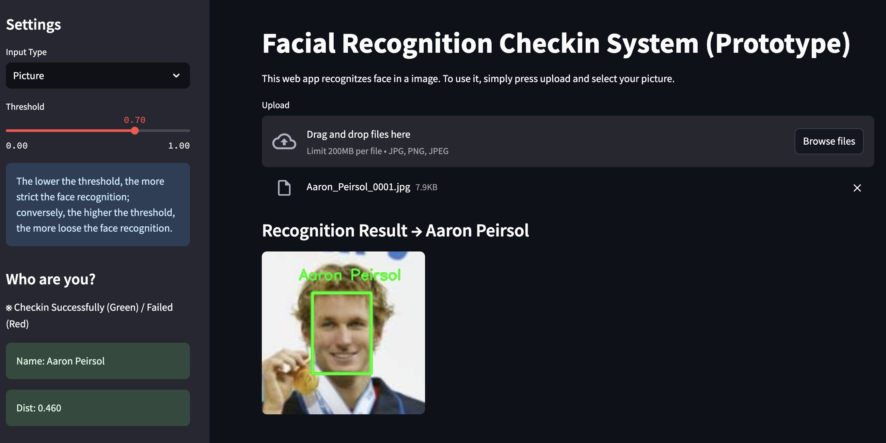
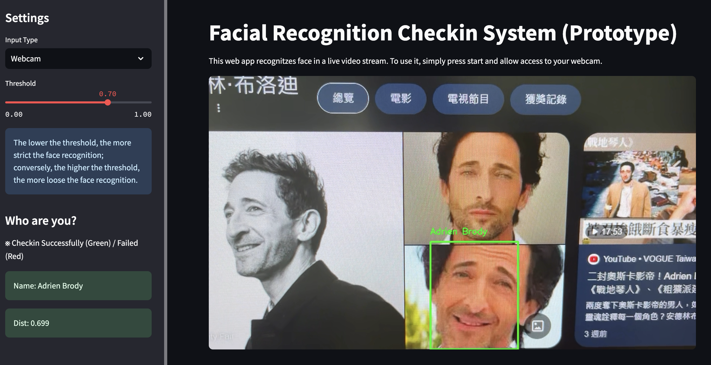

# Facial Recognition Check-in System Prototype

This project is a simple check-in system built with Python, pretrained MTCNN + FaceNet, and Streamlit. It supports facial recognition from uploaded images or a webcam feed.

The system constructs a face database based on the LFW dataset and achieves **96.28% accuracy**, as shown in [`src/demo_on_lfw_dataset.ipynb`](src/demo_on_lfw_dataset.ipynb).

## Demo  
  
  

## Getting Started  

### 1. Clone the Repository  
```bash
git clone https://github.com/chiachii/facial-recognition-checkin-system-prototype.git
cd facial-recognition-checkin-system-prototype/src/
```

### 2. Download the Dataset  
Download the dataset from Kaggle: [LFW Dataset](https://www.kaggle.com/datasets/jessicali9530/lfw-dataset?resource=download)  
Extract and place the following files into `dataset/lfw/`:  
- `lfw-deepfunneled/` (folder)  
- `lfw_allnames.csv`  

### 3. Set Up the Environment  
Create a new environment and install the required dependencies:  
```bash
conda create -n face_checkin python=3.10  # (Optional) Specify Python version
conda activate face_checkin
pip install -r requirements.txt
```

### 4. Build the Facial Embedding Database  
To initialize the database using the **entire LFW dataset**, run:  
```bash
python build_face_db.py --init=True
```
To **add a new user**, place at least one image in `dataset/lfw/lfw-deepfunneled/{user_name}/`, following the naming format `{user_name}_0001.jpg`, and run:  
```bash
python build_face_db.py --add_user={user_name}
```

### 5. Run the App  
```bash
streamlit run app.py
```

## Limitations  
This project does **not** support multi-face recognition. MTCNN may incorrectly detect faces when multiple people appear in an image, leading to misrecognition by FaceNet.  
  

## Reference  
- **Chung Tien Dat (datct00)**: [Face-recognition-app-using-Streamlit](https://github.com/datct00/Face-recognition-app-using-Streamlit)  

